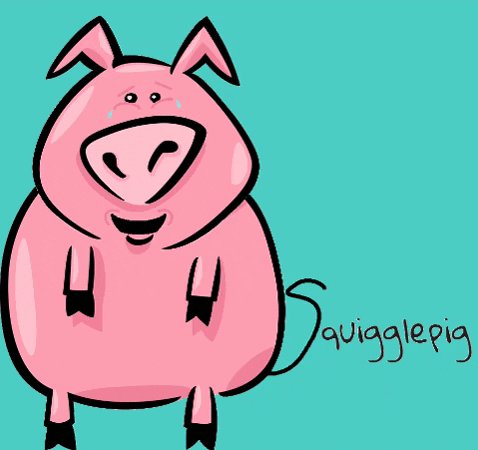

# Squigglepig | Draw Squiggles, Get Giggles

The Squigglepig Team has one focus - we want you to have fun with your friends. Draw an image, have your friends write funny captions, choose and winner, and have a laugh.

## Deployment

Squigglepig is deployed and available for use at http://squigglepig.herokuapp.com/ . 

## Built With

* [MongoDB](https://www.mongodb.com/) - The most popular database for modern apps.
* [Socket.io](https://socket.io/) - The fastest and most reliable real-time engine.
* [React](https://reactjs.org/) - A JavaScript library for building user interfaces.

## Versioning

Squigglepig 1.0 - Release Date 15 May, 2020

## Authors

* **Maxwell Hankner** - *Game Logic - Socket.io Implementation* - [Github](https://github.com/maxwellhankner)
* **Jason Kroening** - *Game Logic - Socket.io Sound Effects - UIFX Implementation* - [Github](https://github.com/skvisual)
* **Chris Wells** - *Game Logic - Canvas Implementation* - [Github](https://github.com/chriswells1995/)
* **R. Alan Williams** - *Back End - API Development Front End - UI/UX* - [Github](https://github.com/rwilliams01101)

## Acknowledgments

* Arron Linton - *Advised on Socket.io logic and API build*
* Kieran Anthony - *Directed integration of new developer code*
* Matt Johnson - *Advised on API integration*
